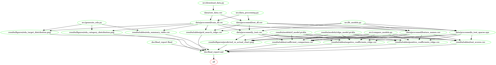

# US Salary Prediction

Authors: Cuthbert Chow, Rong Li, Andy Yang\
Data analysis project to predict salaries for DSCI 522 (Data Science Workflows); a course in the Master of Data Science program at the University of British Columbia.

## About

One of the most important things in the job search is about the salaries, specifically, does this job's salary meet our expectations? However, it is not that easy to set proper expectations. Setting an expectation too high or too low will both be harmful to our job search.

Here, this project is to help you to answer this question: What we can expect a person's salary to be in the US?

To answer this question, we use two different regression models to do the prediction task. The first model we choose is a linear regression model. According to Martín et al. (2018), a linear regression model is a good model for predicting salaries. The second one we choose is the random forest regression model, because of its good nature (i.e., robustness to outliers, low bias, etc.). We score the model using r2 and root mean squared error (RMSE), and it turns out that after hyperparameter optimization, the ridge (which is a linear regressor with regularization) is performing a little bit better than the random forest regressor. On the unseen test data set, our best linear regression model has an r2 score of 0.38 and RMSE of 48398.05.

To further understand which factors provide the most predictive power when trying to predict a person's salary, we present some important features with the highest/lowest coefficients of the linear regression model and some important features with the highest feature importance of the random forest model. We noticed that although the most important features are not very similar for the two models, they are both understandable and somewhat expected, and have important value when trying to understand the factors influencing salary.

The dataset we are analyzing comes from a salary survey from the "Ask a Manager" blog by Alison Green. This dataset contains survey data gathered from "Ask a Manager" readers working in a variety of industries, and can be found [here](https://raw.githubusercontent.com/rfordatascience/tidytuesday/master/data/2021/2021-05-18/survey.csv).

## Report

<!--- I don't think we need this part: We first did some exploratory data analysis (a complete EDA file can be found [here](https://github.com/UBC-MDS/US-Salary-Prediction/blob/main/results/EDA.ipynb)). We noticed that most of the columns are text columns and there are lots of unique values. Therefore, we dropped some columns in our analysis and did column transformation, and we use Ridge to create a model with a 0.38 R2 score. --->

Our final report can be viewed [here](https://htmlpreview.github.io/?https://github.com/UBC-MDS/US-Salary-Prediction/blob/main/doc/final_report.html).

## Usage

### With Docker

To replicate the analysis conducted in this repository with Docker, clone this repository, and then run the following command from the command line at the root directory of this repository. Please ensure the path doesn't include a space character, and if you are using Windows OS please replace the `$(pwd)` with `/$(pwd)`. Note that the whole process will take around 5 minutes:

    docker run --rm -p 8888:8888 -v $(pwd)://home/jovyan/work cuthchow/us-salary-prediction make -C //home/jovyan/work all

To reset the folders with no intermediate artifacts and reports, run the following command in the command line/terminal from the root directory:

    docker run --rm -p 8888:8888 -v $(pwd)://home/jovyan/work cuthchow/us-salary-prediction make -C //home/jovyan/work clean

### Without Docker

To replicate the analysis conducted in this repository without Docker, ensure that all listed dependencies are installed locally, and then clone this repository and run the following command from the command line at the root directory of this repository. Note that the whole process will take around 5 minutes:

    make all

To reset the folders with no intermediate artifacts and reports, run the following command in the command line/terminal from the root directory:

    make clean

### Dependencies

-   python version 3.9.5 and Python packages:

    -   docopt=0.6.2
    -   pandas=1.3.3
    -   scikit-learn=1.0.1
    -   altair=4.1.0
    -   altair_data_server=0.4.1
    -   altair_saver=0.5.0

-   R version 4.1.1 and R packages:

    -   knitr=1.33

### Dependency diagram of the Makefile

## Reference

Green, Alison. 2021. "How Much Money Do You Make?" Ask A Manager. <https://www.askamanager.org/2021/04/how-much-money-do-you-make-4.html>.\
Martín, Ignacio, Andrea Mariello, Roberto Battiti, and José Alberto Hernández. 2018. "Salary Prediction in the IT Job Market with Few High-Dimensional Samples: A Spanish Case Study." International Journal of Computational Intelligence Systems 11: 1192--1209. <https://doi.org/https://doi.org/10.2991/ijcis.11.1.90>.
