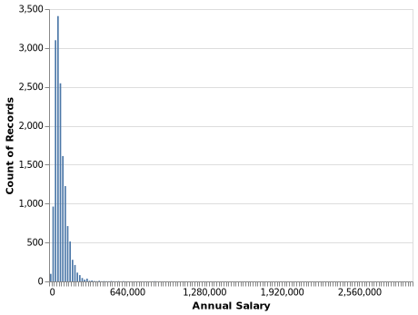

```{r setup, include=FALSE}
knitr::opts_chunk$set(echo = TRUE)
```

## Aim and Summary

The main predictive question we wish to answer is what we can expect a person's salary to be in the US, given a certain professional history (such as years of experience, industry, or age). We will use a linear regression model to do the prediction. In the process, we wish to understand which factors provide the most predictive power when trying to predict a person's salary.

## Methods

### Data 

```{r, child=c('data.Rmd')}
```

## Analysis


## Results and Discussion

```{r fig.cap = "Figure 3", echo = FALSE, fig.width = 5, fig.height = 4, out.width = "50%"}

```

## References


