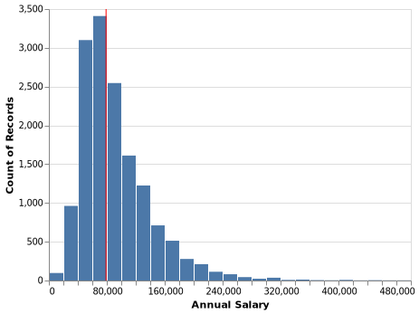
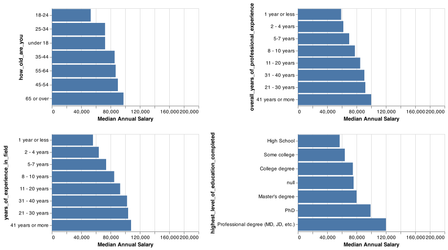
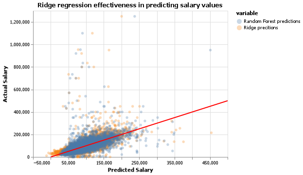

Final Report
================
Cuthbert Chow, Rong Li, Andy Yang
2021-12-10

-   [Aim and Summary](#aim-and-summary)
-   [Data & Method](#data--method)
-   [Analysis](#analysis)
    -   [Data Exploration](#data-exploration)
    -   [Data cleaning](#data-cleaning)
    -   [Find the best model](#find-the-best-model)
    -   [Important Features](#important-features)
    -   [Results & Discussion](#results--discussion)
-   [References](#references)

## Aim and Summary

One of the most important things in the job search is about the
salaries, specifically, does this job’s salary meet our expectations?
However, it is not that easy to set proper expectations. Setting an
expectation too high or too low will both be harmful to our job search.

Here, this project is to help you to answer this question: What we can
expect a person’s salary to be in the US?

To answer this question, we use two different regression models to do
the prediction task. The first model we choose is a linear regression
model. According to Martín et al. (2018), a linear regression model is a
good model for predicting salaries. The second one we choose is the
random forest regression model, because of its good nature (i.e., robust
to outliers, low bias, etc.)(Kho 2019). We score the model using r2 and
root mean squared error (RMSE), and it turns out that after
hyperparameter optimization, the ridge (which is a linear regressor with
regularization) is performing a little bit better than the random forest
regressor. On the unseen test data set, our best linear regression model
has an r2 score of 0.38 and RMSE of 48398.05.

To further understand which factors provide the most predictive power
when trying to predict a person’s salary, we present some important
features with the highest/lowest coefficients of the linear regression
model and some important features with the highest feature importance of
the random forest model. We noticed that although the most important
features are not very similar for the two models, they are both
understandable and somewhat expected.

## Data & Method

The dataset we are analysing comes from a salary survey from the “Ask a
Manager” blog by Alison Green. This dataset contains survey data
gathered from “Ask a Manager” readers working in a variety of industries
(Green 2021).

As references, we utilized the guide for methodological practices
regarding linear, ridge and lasso regression(Jain 2017), as well as the
article from Martín et al. (2018) which recommended linear regression
for problems similar to the one we are analysing.  
We also select the random forest regression model according to Kho
(2019).

The Python (Van Rossum and Drake 2009) and R (R Core Team 2021)
programming languages and the following Python and R packages were used
to perform the data analysis and present results: Pandas (Reback et al.
2020), Scikit-learn (Pedregosa et al. 2011), Altair (VanderPlas et al.
2018), docopt (Keleshev 2014), knitr (Xie 2021).

## Analysis

### Data Exploration

First, we looked at the distribution of our target “Annual Salary”. As
shown in the graph below, it seems to be a largely right-skewed
distribution. And the median salary is around $80,000.

Here is some general information about our dataset:

To look at whether the features in our dataset are useful to predict
annual salary, we first looked at a summary table about our features:

| Features                                 | Not.Null.Count | Null.Count | Number.of.Unique.Values | Types   |
|:-----------------------------------------|---------------:|-----------:|------------------------:|:--------|
| how_old_are_you                          |          15037 |          0 |                       7 | object  |
| industry                                 |          15008 |         29 |                     675 | object  |
| job_title                                |          15037 |          0 |                    7970 | object  |
| other_monetary_comp                      |          11282 |       3755 |                     583 | float64 |
| state                                    |          14914 |        123 |                     108 | object  |
| city                                     |          15006 |         31 |                    2482 | object  |
| overall_years_of_professional_experience |          15037 |          0 |                       8 | object  |
| years_of_experience_in_field             |          15037 |          0 |                       8 | object  |
| highest_level_of_education_completed     |          14935 |        102 |                       6 | object  |

Table 1 - Summary Information About Key Features

We noticed that there are lots of null values in the additional
information features (additional_context_on_job_title,
additional_context_on_income, etc), and some of the variables have a lot
of unique values. Therefore, later we dropped the two additional
information features and used the bag-of-words model to extract features
from text columns such as industry and job title.

Since variables with 100s or 1000s of distinct values would be harder to
visualize in a meaningful way, here we are exploring those variables
that have \< 10 unique values and check their distributions and
relationships with the annual salary,

As shown above, the higher salaries are roughly associated with the
older age groups, the longer experience and the higher education, which
indicates those are likely to be good predictors of our target.

### Data cleaning

We chose two different types of models to predict annual salary based on
the given features in the dataset. A linear model, Ridge, and an
ensemble model, RandomForestRegressor. To ensure that the models were
not overfitting to training data, we conducted some additional data
cleaning. Firstly, *annual_salary* values within the training dataset of
less than 10,000 USD or over 1,000,000 USD were removed. Additionally,
text values that occurred less than 5 times in the *state* or *city*
features were imputed with an empty string. This ensures that highly
specific values will be removed which ultimately helps reduce
overfitting.

### Find the best model

To score the models, we relied on the r2 and root mean squared error
scores since they are simple to interpret. Since the annual salary
target of the test set can be 0, MAPE would not be a suitable metric in
this scenario. We did not filter the test dataset to allow for MAPE
scoring since this would bias the test set against evaluation data.

Hyperparameter optimization was performed on the Ridge and Random Forest
models. For Ridge, the alpha parameter was optimized with a search space
spanning 10(−5) − 10(5) with 20 total iterations.
The ideal alpha value which provided the highest r2 score was determined
to be approximately 6.16 as seen by the results table.

|        r2 | Negative.RMSE |        alpha |
|----------:|--------------:|-------------:|
| 0.4952179 |     -37852.02 | 6.158482e+00 |
| 0.4910140 |     -38009.13 | 2.069138e+01 |
| 0.4892775 |     -38074.54 | 1.832981e+00 |
| 0.4768487 |     -38535.54 | 5.455595e-01 |
| 0.4740495 |     -38637.41 | 6.951928e+01 |
| 0.4647394 |     -38979.44 | 1.623777e-01 |
| 0.4572101 |     -39252.72 | 4.832930e-02 |
| 0.4538497 |     -39373.37 | 1.438450e-02 |
| 0.4523925 |     -39426.25 | 3.793000e-04 |
| 0.4520337 |     -39439.02 | 4.281300e-03 |
| 0.4513788 |     -39461.73 | 1.129000e-04 |
| 0.4512609 |     -39465.70 | 1.000000e-05 |
| 0.4512501 |     -39466.43 | 3.360000e-05 |
| 0.4512336 |     -39467.41 | 1.274300e-03 |
| 0.4439331 |     -39728.32 | 2.335721e+02 |
| 0.4026841 |     -41175.61 | 7.847600e+02 |
| 0.3457046 |     -43095.39 | 2.636651e+03 |
| 0.2605887 |     -45814.10 | 8.858668e+03 |
| 0.1527303 |     -49041.58 | 2.976351e+04 |
| 0.0661657 |     -51484.57 | 1.000000e+05 |

Table 2.1 - Scores For Various Alpha Values

For Random Forest Regressor, we optimized the n_estimators for speed. We
searched for performance increases within the hyperparameters of 10, 20,
50, and 100 trees. We picked the 50 tree regressor for time savings,
since the 100 tree regressor provided very little performance boost
compared to processing time required.

|   test.r2 |  train.r2 | Negative.RMSE | n_estimators |
|----------:|----------:|--------------:|-------------:|
| 0.4605616 | 0.9260365 |     -39139.02 |          100 |
| 0.4530413 | 0.9163876 |     -39409.02 |           20 |
| 0.4520001 | 0.9248364 |     -39449.32 |           50 |
| 0.4325112 | 0.9032956 |     -40135.90 |           10 |

Table 2.2 - Scores For Various n_estimators

By comparing the two models’ cross-validation scores above, We
ultimately selected the Ridge model with the alpha value around 6.16, as
it provided better results on both r2 and root mean squared error.

### Important Features

We can gain insight into how our model makes predictions by analysing
the coefficient values associated with the regression. The tables below
show the difference in salary that the model predicts given the change
in the associated feature for the Ridge model. The first table displays
the top 10 positive coefficients.

| Feature       | Coefficient |
|:--------------|------------:|
| physician     |    74378.06 |
| svp           |    63693.00 |
| md            |    62148.93 |
| partner       |    58460.39 |
| psychiatrist  |    53449.05 |
| city_Bay Area |    46940.70 |
| equity        |    45417.85 |
| chief         |    43903.58 |
| machine       |    41832.51 |
| onlyfans      |    41546.77 |

Table 3.1 - Ten most positive coefficients

The top 10 most positively correlated features with higher income are
somewhat expected, as they mostly consist of text features that
represent high-paying jobs, or titles such as MD. An interesting feature
we didn’t expect was onlyfans, which is a more recent phenomenon. This
shows the effects of modern technology on methods to earn income.

| Feature          | Coefficient |
|:-----------------|------------:|
| paralegal        |   -38459.81 |
| resident         |   -28017.91 |
| adjunct          |   -24873.13 |
| office           |   -23446.57 |
| clerk            |   -21622.61 |
| bookkeeper       |   -20096.76 |
| assistant        |   -18435.04 |
| city_Tallahassee |   -18421.47 |
| legal            |   -18358.64 |
| secretary        |   -18255.88 |

Table 3.2 - Ten most negative coefficients

The most negative coefficient features are also somewhat expected, as
they mostly consist of traditionally lower-paying jobs in the US.

The top 10 positive features from Ridge and the top 10 most important
features from the random forest model are presented below. We can see
the differences between the two models are huge - the most important
features are not overlapping between the two models. However, when we
tried to interpret the result we found both are understandable. For
example, “senior” and “director” are getting high feature importance in
the random forest model.

| Significance.Rank | Ridge.Feature | Ridge.Coefficient | Random.Forest.Feature                    | RandomForest.Coefficient |
|------------------:|:--------------|------------------:|:-----------------------------------------|-------------------------:|
|                 1 | physician     |          74378.06 | other_monetary_comp                      |                   0.2637 |
|                 2 | svp           |          63693.00 | years_of_experience_in_field             |                   0.0614 |
|                 3 | md            |          62148.93 | highest_level_of_education_completed     |                   0.0512 |
|                 4 | partner       |          58460.39 | computing                                |                   0.0447 |
|                 5 | psychiatrist  |          53449.05 | overall_years_of_professional_experience |                   0.0170 |
|                 6 | city_Bay Area |          46940.70 | how_old_are_you                          |                   0.0159 |
|                 7 | equity        |          45417.85 | senior                                   |                   0.0140 |
|                 8 | chief         |          43903.58 | state_California                         |                   0.0129 |
|                 9 | machine       |          41832.51 | director                                 |                   0.0110 |
|                10 | onlyfans      |          41546.77 | engineer                                 |                   0.0104 |

Table 4 - Feature importance comparison

Note that the feature importance value is incomparable between the two
models since the random forest model is not linear, and cannot be
interpreted in the same way as the coefficients for the ridge.
Nonetheless, viewing the coefficients can still inform us about the
specific features which each model deems to be the most important.

Overall, job title seems to influence a lot when we tried to predict
salaries in the US. City name seems also to play a role there.

### Results & Discussion

Here, we evaluated the best model we found (the Ridge model with the
alpha value around 6.16) on the test data. The results can be seen in
the table below.

| Metric | Ridge.Scores |
|:-------|-------------:|
| R2     |         0.38 |
| RMSE   |     48398.03 |

Table 5 - Scores of Ridge Model on Test Data

As we can see, the R2 score is 0.38, suggesting that 38% of the variance
can be explained by our model. The test score is a bit different from
the validation score, so there might be a lot of variance within the
data set.

To visualize the effectiveness of our models, we can plot the predicted
salary values against the actual salary values and compare the
correlation to a 45 degree line.

Overall, the model provides an acceptable estimate within the range of 0
to 200,000. However, it performs poorly when trying to predict higher
values (>500,000). There seems to be a trend of underestimating higher
values.

So, several things could be done to further improve this model in
future. First of all, doing some feature engineering might help us get a
better model, such as including some polynomial terms. Also, we might be
able to solve the problem of extreme values using different
regularization/loss functions. Additionally, we can consider using some
other tree-based ensemble models.

## References

Green, Alison. 2021. “How Much Money Do You Make?” *Ask A Manager*.
<https://www.askamanager.org/2021/04/how-much-money-do-you-make-4.html>.

Jain, Shubham. 2017. “A Comprehensive Beginners Guide for Linear, Ridge
and Lasso Regression in Python and r.” *Analytics Vidhya*.
<https://www.analyticsvidhya.com/blog/2017/06/a-comprehensive-guide-for-linear-ridge-and-lasso-regression/>.

Keleshev, Vladimir. 2014. *Docopt: Command-Line Interface Description
Language*. <https://github.com/docopt/docopt>.

Kho, Julia. 2019. “Why Random Forest Is My Favorite Machine Learning
Model.” *Medium*. Towards Data Science.
<https://towardsdatascience.com/why-random-forest-is-my-favorite-machine-learning-model-b97651fa3706>.

Martín, Ignacio, Andrea Mariello, Roberto Battiti, and José Alberto
Hernández. 2018. “Salary Prediction in the IT Job Market with Few
High-Dimensional Samples: A Spanish Case Study.” *International Journal
of Computational Intelligence Systems* 11: 1192–1209.
https://doi.org/<https://doi.org/10.2991/ijcis.11.1.90>.

Pedregosa, Fabian, Gaël Varoquaux, Alexandre Gramfort, Vincent Michel,
Bertrand Thirion, Olivier Grisel, Mathieu Blondel, et al. 2011.
“Scikit-Learn: Machine Learning in Python.” *Journal of Machine Learning
Research* 12 (Oct): 2825–30.

R Core Team. 2021. *R: A Language and Environment for Statistical
Computing*. Vienna, Austria: R Foundation for Statistical Computing.
<https://www.R-project.org/>.

Reback, Jeff, jbrockmendel, Wes McKinney, Joris Van den Bossche, Tom
Augspurger, Phillip Cloud, Simon Hawkins, et al. 2020.
*Pandas-Dev/Pandas: Pandas* (version latest). Zenodo.
<https://doi.org/10.5281/zenodo.3509134>.

Van Rossum, Guido, and Fred L. Drake. 2009. *Python 3 Reference Manual*.
Scotts Valley, CA: CreateSpace.

VanderPlas, Jacob, Brian Granger, Jeffrey Heer, Dominik Moritz, Kanit
Wongsuphasawat, Arvind Satyanarayan, Eitan Lees, Ilia Timofeev, Ben
Welsh, and Scott Sievert. 2018. “Altair: Interactive Statistical
Visualizations for Python.” *Journal of Open Source Software* 3 (32):
1057.

Xie, Yihui. 2021. *Knitr: A General-Purpose Package for Dynamic Report
Generation in r*. <https://yihui.org/knitr/>.

